# 🏋️ Fitness Center Database Management System

A powerful and intuitive database management system for fitness centers, designed to handle the complexities of managing members, staff, classes, and facilities. Built using Python Flask, ReactJS, and Oracle SQL, this project ensures efficient and seamless operation.

---

## 📖 Project Overview

As fitness centers grow in popularity, so does the need for efficient management of member and staff data. This project provides an integrated solution to manage operations smoothly, ensuring accurate membership tracking, class scheduling, and effective facility usage.

### Key Features

- **Member and Staff Management**
  - Tracks membership, dues, achievements, and assigned trainers.
  - Allows users to register, pay dues, schedule classes, and update their profiles.
  - Admins can assign trainers, manage payroll, and designate maintenance staff for facilities.

- **Class Scheduling and Facility Management**
  - Prevents overcrowding by managing time slots effectively.
  - Enforces facility usage limits to maintain a safe environment.
  - Allows admins to assign classes and trainers based on real-time availability.

- **Data Integrity and Normalization**
  - Database designed in Boyce-Codd Normal Form (BCNF) to minimize redundancy and enforce data integrity.
  - Includes triggers to validate data and enforce business rules.

---

## 🛠️ Technologies Used

- **Frontend**: ReactJS
- **Backend**: Python Flask
- **Database**: Oracle SQL
- **Libraries**: cx_Oracle for database connectivity

---

## 🗄️ Database Structure

The database schema consists of several tables organized in BCNF. Here are some key tables:

- **Customers**: Stores member details and membership status.
- **Employee**: Tracks information about trainers and maintenance staff.
- **Facilities**: Details available facilities along with maintenance costs.
- **Classes**: Contains class schedules and assigned head coaches.
- **Records**: Stores member achievements and progress metrics.

The system includes triggers for business logic enforcement, such as ensuring dues are cleared before account deletion, limiting facility access, and avoiding scheduling conflicts for trainers.

---

## 🚀 Getting Started

1. **Clone the repository**:
   ```bash
   git clone https://github.com/yourusername/fitness-center-dbms.git
   cd fitness-center-dbms
   ```

2. **Database Setup**:
   - Use `database/schema.sql` for creating database tables.
   - Initialize with sample data from `database/initial_data.sql`.

3. **Run Backend**:
   ```bash
   python -m venv venv
   source venv/bin/activate
   pip install -r requirements.txt
   flask run
   ```

4. **Start Frontend**:
   ```bash
   cd client
   npm install
   npm start
   ```

---

## 📈 Screen-Shots

1. 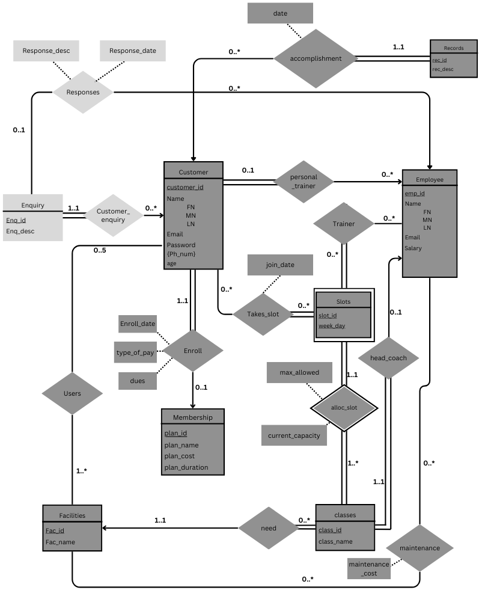
2. 
3. 
4. 
5. 
6. 
7. 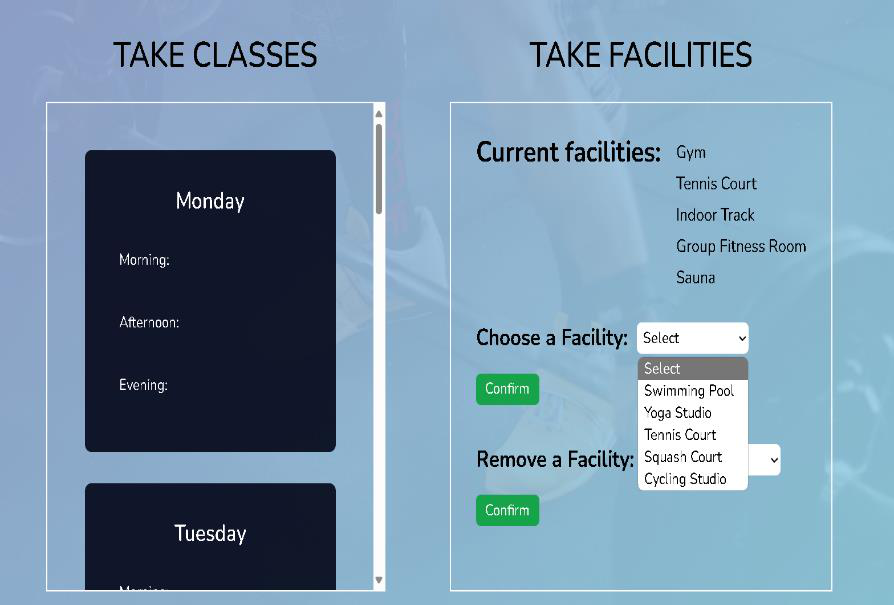
8. 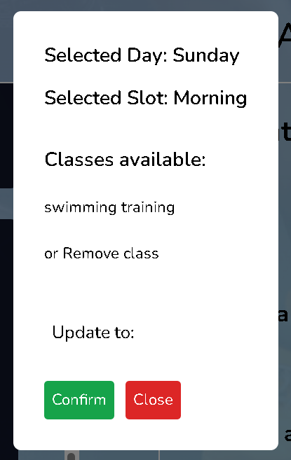
9. 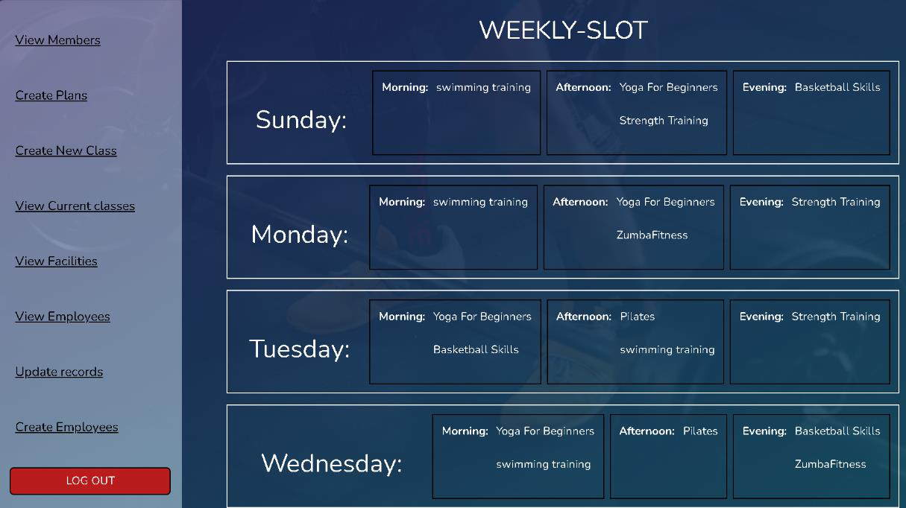
10. 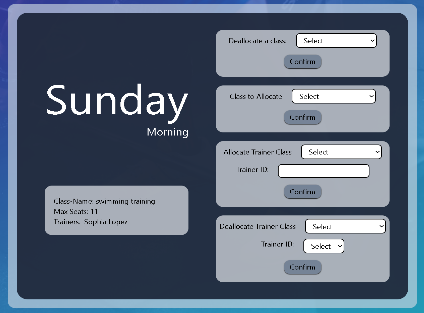
11. 
12. 
13. 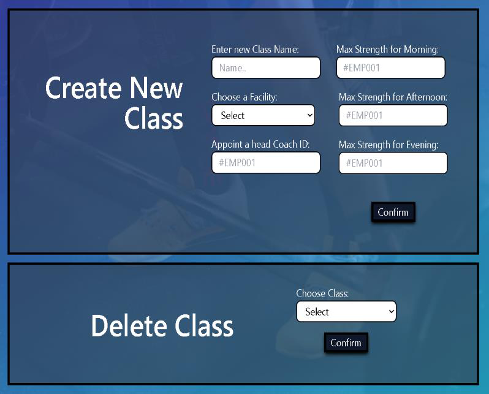
14. 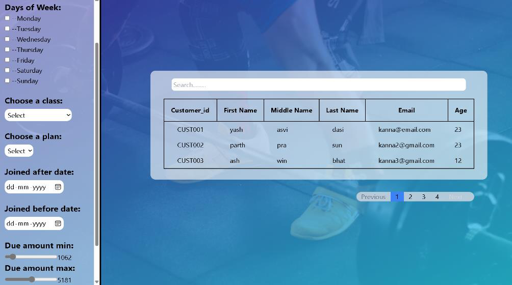
15. 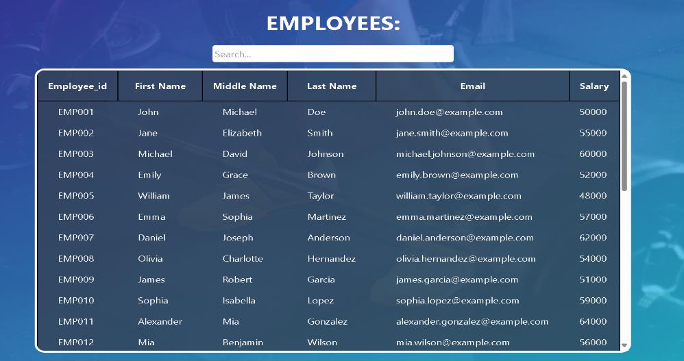
16. 
17. 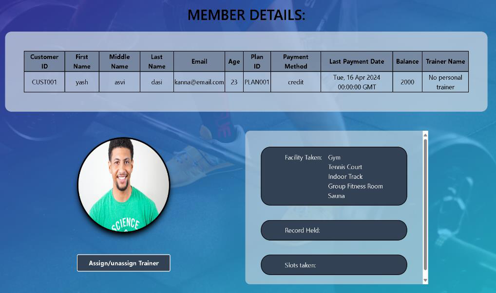
18. 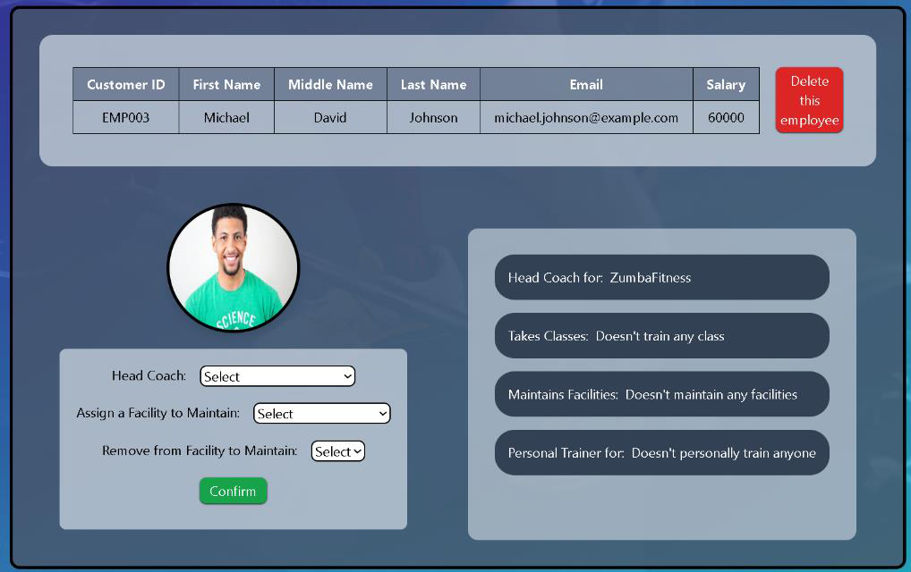
19. 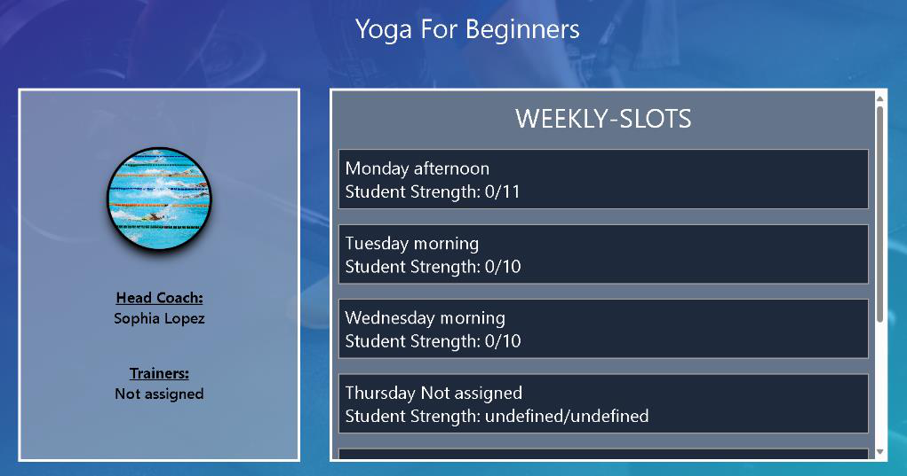


---


## 📈 Future Enhancements

- **Enquiry System**: Enable members to submit inquiries to staff.
- **Employee Login**: Allow employees to manage their schedules independently.
- **Dashboard Metrics**: Provide insights into memberships, revenue, and maintenance costs.
- **Performance Tracking**: Add BMI and other health metrics for gym users.

---

## 👥 Contributors

- **Dasi Yashasvi** - 220962400
- **Ashwin Bhat** - 220962412

---

## 📚 References

- *Database System Concepts* by Abraham Silberschatz, Henry F. Korth, and S. Sudarshan
