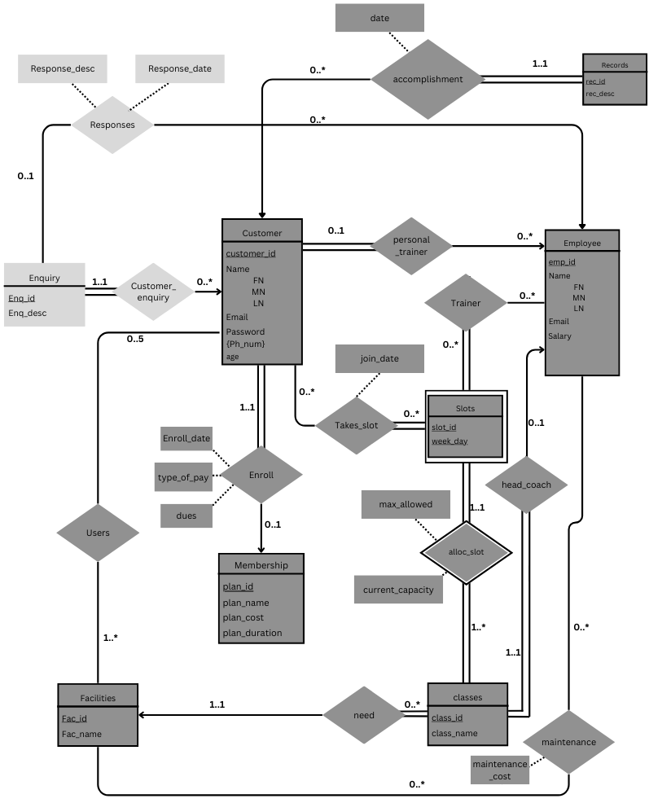
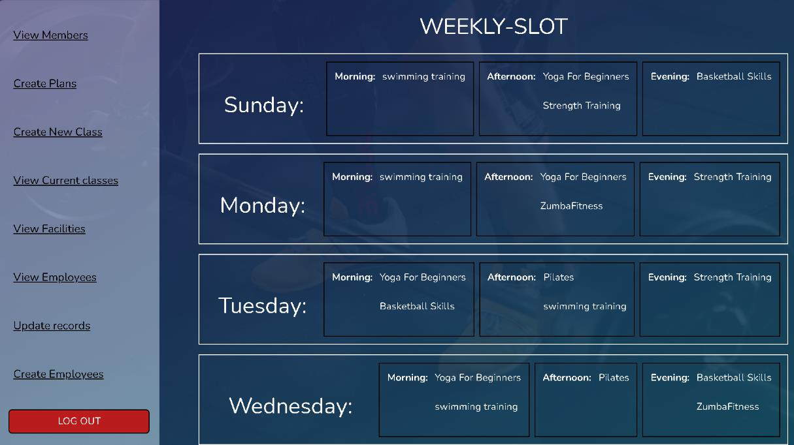
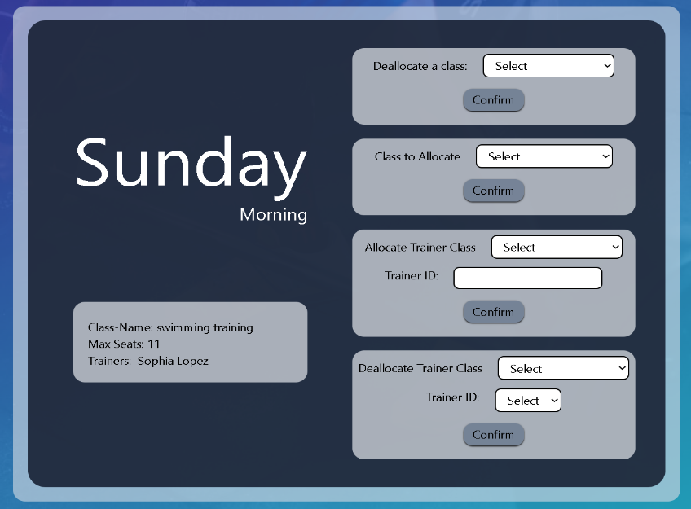

{width="6.25in"
height="0.7472222222222222in"}

> **Mini Project Report**\
> **of**\
> **Database Systems Lab (CSE 2262)**
>
> **FITNESS CENTER DATABASE MANAGEMENT SYSTEM**
>
> **SUBMITTED**\
> **BY**
>
> **Dasi Yashasvi -- 220962400 -- 63 - A2 Ashwin Bhat -- 220962412 -- 67
> -- A2**
>
> **Department of Computer Science and Engineering Manipal Institute of
> Technology, Manipal.**

**April 2024**

{width="6.25in"
height="0.7472222222222222in"}

**DEPARTMENT OF COMPUTER SCIENCE & ENGINEERING**

> **Manipal**\
> **17/04/2024**

**CERTIFICATE**

This is to certify that the project titled **Mini Project Title** is a
record of the Bonafede work done by **Dasi Yashasvi (220962400), Ashwin
Bhat (220962412)** submitted in partial fulfilment of the requirements
for the award of the Degree of Bachelor of Technology (B.Tech.) in
COMPUTER SCIENCE & ENGINEERING of Manipal Institute of Technology,
Manipal, Karnataka, (A Constituent Institute of Manipal Academy of
Higher Education), during the academic year 2023-2024.

**Name and Signature of Examiners:**

> **1.Dr. Anup Bhat B, Assistant Professor, Dept. of CSE**
>
> **2.Dr. Vijaya Arjunan, Additional Professor, Dept. of CSE**
>
> **3.Dr. T Sujithra, Associate Professor, Dept. of CSE (A2 Batch)**
>
> **4.Dr. Shwetha Rai, Assistant Professor-Senior Scale, Dept. of CSE
> (A1** **Batch)**

**TABLE OF CONTENTS**

**ABSTRACT**\
**CHAPTER 1: PROBLEM STATEMENT & OBJECTIVES CHAPTER 2: INTRODUCTION**\
**CHAPTER 3: METHODOLOGY**\
**CHAPTER 4: RESULTS & SNAPSHOTS**\
**CHAPTER 5: CONCLUSION**\
**CHAPTER 6: LIMITATIONS & FUTURE WORK**\
**CHAPTER 7: REFERENCES**

**Abstract**

The database management system for fitness centers is a deeply layered
management system built using Python Flask, ReactJS, and Oracle SQL. It
features complex and extensive management of both clients who are
registered in the fitness facility and the staff that work there.
Different triggers guarantee that data submitted and updated is
consistent. This system also features a comprehensive error management
system that alerts the user or employee in the event that a mistake is
entered. The database underwent the five phases of ER model conversion
after it was initially created as an ER model. Subsequently, the
established relationships were examined to see if they adhered to Boyce
Codd Normal Form or not, if they were not then they were converted into
BCNF, final relations comprised of more than 10 tables, all of them
being in BCNF form. Then the front end was developed around the triggers
and entities.

**Problem Statement**

Modern fitness centers, like MARENA, require the storage of data of both
members and staff

to keep track of the huge number of people that come regularly. Not
doing so, will ultimately

lead to confusion and inaccuracies. For example, checking if a
membership is valid,

scheduling of classes, and many other problems. Hence, we require a
system to help organize

the traffic of incoming users in an efficient and organized manner.

**Objectives**

Fitness center database management system was first designed to solve
many problems like:

> •Tracking of dues: The system is designed to update the status of
> their membership and
>
> to help remind the users to renew their membership.
>
> •Records and Titles: Our database aims to keep thorough records of the
> users'
>
> accomplishments so that the members can have a general idea of their
> relative
>
> performances.
>
> •Time Slot Scheduling: By allocating everyone who is taking part in
> sports classes
>
> which usually have fixed timings, we can minimize overcrowding of the
> gym.
>
> •Facility Utilization limits: By enforcing a maximum limit on the
> facilities to prevent
>
> overcrowding and create a safe and comfortable environment.
>
> •Performance: Members\' progress, accomplishments, and areas for
> growth are tracked
>
> in their performance records.
>
> •Employee Management: This helps us keep track of employee personnel,
> manage
>
> payroll, and manage the workforce.
>
> •Trainer Assignment: becomes vital that we keep track of their
> timeslots and assigned
>
> trainers to better guide the members.

We were able to achieve most of the goals from the above aspects first
decided for the project and we were successfully were able to implement
the database in easy to understand\
graphical user interface for easier access and working.

**Introduction**

Fitness has become a crucial part of many people\'s lives in today\'s
fast-paced society, resulting in a rise in the popularity of fitness
centers such as MARENA. As the number of members and staff continues to
grow, the importance of efficient data management systems has become
essential. The traditional ways of keeping records are no longer
adequate to manage membership tracking, class scheduling, and facility
management efficiently.

Therefore, there is a strong need for a reliable database management
system designed specifically for the requirements of contemporary
fitness centers.

This project main challenge was to make an intricate database, essential
for information storage as well as working of the system on a whole.
From the assignment of trainers to the assignment of classes on specific
slots are made so that they adhere to rules/triggers created which we
will talk about in coming sections. We wanted to have a consistent
database that is all tables should follow the same normal form which we
chose it to be Boyce Codd normal form. We started by deciding on strong
entities like customers, employees, facilities and classes which will
start as the starting point. Then we connected these strong entities
with of help of relations with each other giving rise to many other
entities and relationship attributes finally forming an ER model. We
were not satisfied by the ER model so we decided to add more entities
like slots(weak entity), records and enquires. Though we were not able
to implement the enquiry relation into our front-end we would like to
extend out work and include the enquiry-response relation in the future.

The ER model was then put thorough 5 step process of converting it into
relation schemas of strong entities, weak entities, relationship
entities, deleting similar entities and merging entities which same
super key to reduce redundancy. Then the gained schemas were normalized
to BCNF. We decided to convert every relation to BCNF because it is\
stronger/restricted than 3NF and other normal forms while giving minimum
redundancy, though may result in dependency unpreserving at some times
but we accepted that limitation.

After the complete conversion into BCNF, we started working on ORACLE
SQL, by creating the relation tables and inserting pre-required values
which in our case were the facilities. We decided that the facilities
were already provided by the Fitness center and hence there will be no
need for insert update or delete on those facilities. Then the values
were manually inputted thought the UI designed with the help of ReactJS.
We connected the ORACLE SQL server with a Python backend with the help
of CX_ORACLE library provided in python. As the user Clicked on
different input options, the SQL query was constructed in the frontend
itself, after user clicks submit button; the query is then sent to the
backend python server with the help of an API 'Flask', Flask provides a
connection to link our frontend to running backend, after the query
which was sent to the backend is received by the python. It checks if
the query is DQL query (SELECT) or a DML query (UPDATE, DELETE, INSERT).
If it is an DML query then the backend performs a 'commit;' operation
after each query as to complete the\
transaction.

**Front-End Requirements:**

> 1.User must be able to create their account\
> 2.User must be able to track his and pay his dues\
> 3.User must be able to take slot of their choice and day for their
> choice and take any class which is available on that slot and day\
> 4.User must be able to delete his account if his dues is 0\
> 5.User must be able to take any 5 facilities\
> 6.User must be able to change his data\
> 7.Admin should be able assign classes on any of the slot and on any of
> the day 8.Admin should be able to view all users and their individual
> data too\
> 9.Admin should be able to view all employees and their individual data
> too\
> 10.Admin should be able to view all classes and facilities\
> 11.Admin should be able to assign/unassign trainers to different
> classes\
> 12.Admin should be able to assign personal trainers to users\
> 13.Admin should be able to assign head coaches to classes\
> 14.Admin should be able to assign employees to maintain facilities\
> 15.Admin should be able to create new plans\
> 16.Admin should be able to create new classes\
> 17.Admin should be able to create new employee\
> 18.Admin should be able to create new records\
> 19.Every update must be a single transaction

**Methodology**

Model requirements:\
1.Users can have 0 or 1 personal trainer\
2.User has to have a membership taken\
3.User can take 0 or at-most 5 facilities to take\
4.There are 3 slots in each of the 7 days of the week\
5.Classes can be only once per day that is class have at most 1 slot per
day\
6.The current members cannot cross max members\
7.The slot and class will have a max member value and current members
cannot exceed the max value\
8.Classes while creating should have 1 head coach and then head coach
can be updated later on at most 1.

> 9.Facilities can have 0 or more employes maintaining it\
> 10.Employes can be personal trainers for 0 or more users\
> 11.Employees can be maintenance workers for 0 or more facilities\
> 12.Employees can be trainers for 0 or more classes, cannot trainer 2
> different classes on the same slot, same day

**ER MODEL**:

  ---------------------------------------------------------------------------------------------
  {width="6.298611111111111in"
  height="7.9375in"}
  ---------------------------------------------------------------------------------------------

  ---------------------------------------------------------------------------------------------

**Conversion to Relation schema Steps:**

> **1.**Identifying and converting Strong Entitles
>
> •Customer([customer_id]{.underline}, first_name, middle_name,
> last_name, email, password, {phnum}, [age)]{.underline}\
> •Membership([plan_id]{.underline}, plan_name, plan_cost, duration)\
> •Classes ([class_id]{.underline}, class_name)\
> •Facilities ([fac_id]{.underline}, fac_name)\
> •Employee ([emp_id]{.underline}, first_name, middle_name, last_name,
> email, salary)•Enquiry ([enq_id]{.underline}, enq_desc)\
> •Records ([rec_id]{.underline}, rec_name)
>
> **2.**Identifying Weak Entities
>
> •Slots([slot_id]{.underline}, [weekday]{.underline},
> [class_id]{.underline})
>
> **3.**Identifying Relationship entities
>
> •Uses([customer_id]{.underline}, [fac_id]{.underline})\
> •Enroll([customer_id]{.underline}, plan_id, enroll_date, type_of_pay,
> dues) •Need([class_id]{.underline}, fac_id)\
> •Customer_enquiry([enq_id]{.underline}, customer_id)\
> •Responses([enq_id]{.underline}, [emp_id]{.underline}, response_date,
> response_desc) •Alloc_slots([class_id]{.underline},
> [slot_id]{.underline}, [weekday]{.underline}, max_allowed, current)
> •Takes_slots([customer_id]{.underline}, [class_id]{.underline},
> [slot_id]{.underline}, [weekday]{.underline}, join_date)
> •Trainer([emp_id]{.underline}, [class_id]{.underline},
> [slot_id]{.underline}, [weekday]{.underline})\
> •Headcoach([emp_id]{.underline}, [class_id]{.underline})\
> •Personal_trainer([customer_id]{.underline}, emp_id)\
> •Maintenance([emp_id]{.underline}, [fac_id]{.underline}, main_cost)\
> •Accomplishment([customer_id]{.underline}, [rec_id]{.underline})
>
> **4.**Deleting Matching Schemas
>
> •Slots([slot_id]{.underline}, [weekday]{.underline},
> [class_id]{.underline}) same as Alloc_slots([class_id]{.underline},
> [slot_id]{.underline}, [weekday]{.underline},
> max\_[allowe]{.underline}d, [current)]{.underline}
>
> **5.**Merging similar schemas
>
> •Enroll([customer_id]{.underline}, plan_id, enroll_date, type_of_pay,
> dues) with\
> Custom[er(customer_id]{.underline}, first_name, Middle_Name,
> Last_name, email, password, {phnum}, [age)]{.underline}\
> •Customer_enquiry([enq_id]{.underline}, customer_id) with Enquiry
> ([enq_id]{.underline}, enq_desc) •Need([class_id]{.underline}, fac_id)
> with Classes ([class_id]{.underline}, class_name)\
> •Headcoach([emp_id]{.underline}, [class_id]{.underline}) with Classes
> ([class_id]{.underline}, class_name)
>
> •Accomplishment([customer_id]{.underline}, [rec_id]{.underline}) with
> Records ([rec_id]{.underline}, rec_name)
> •Personal_trainer([customer_id]{.underline}, emp_id) with
> Customer([customer_id]{.underline}, first_name, middle_name,
> las[t_name, em]{.underline}ail, password, {phnum}, a[ge)]{.underline}

So finally, all the schemas which we got are:

> •Customers([customer_id]{.underline}, first_name, Middle_Name,
> Last_name, email, password, age, plan_i[d, enroll_dat]{.underline}e,
> plan_name, plan_cost, duration, emp_id)\
> •Membership([plan_id]{.underline}, plan_name, plan_cost, duration)\
> •Classes ([class_id]{.underline}, class_name, fac_id, head_id)\
> •Facilities ([fac_id]{.underline}, fac_name)\
> •Employee ([emp_id]{.underline}, first_name, middle_name, last_name,
> email, salary)\
> •Enquiry ([enq_id]{.underline}, enq_desc, customer_id)\
> •Records ([rec_id]{.underline}, rec_name, customer_id)\
> •Uses([customer_id]{.underline}, [fac_id]{.underline})\
> •Responses([enq_id]{.underline}, [emp_id]{.underline}, response_date,
> response_desc)\
> •Alloc_slots([class_id]{.underline}, [slot_id]{.underline},
> [weekday]{.underline}, max_allowed, current)\
> •Takes_slots([customer_id]{.underline}, [class_id]{.underline},
> [slot_id]{.underline}, [weekday]{.underline}, join_date)\
> •Maintenance([emp_id]{.underline}, [fac_id]{.underline}, main_cost)\
> •Trainer([emp_id]{.underline}, [class_id]{.underline},
> [slot_id]{.underline}, [weekday]{.underline})

Multi-valued attribute table:\
•Phnum([customer_id]{.underline}, [phone]{.underline})

With a total of 14 Schemas, we proceeded with normalization to BCNF

**Boyce Codd Normal Form Normalization**

Boyce-Codd Normal Form (BCNF) is a higher level of normalization in
database design, primarily used to reduce redundancy and anomalies in a
relational database. It\'s an extension of the Third Normal Form (3NF)
and ensures that that the Function dependency is trivial, if not then
the antecedent must be the super key.

If we found that a Relation is not in BCNF we will decompose the
relation into 2 or more relations until they satisfy the BCNF
conditions.

**1.Checking Customers(customer_id, first_name, Middle_Name, Last_name,
email,** **password, age, plan_id, plan_name, plan_cost, duration)**

> Important Functional Dependencies:
>
> •FD1 - customer_id → first_name, middle_name, last_name, email,
> password, age, plan_id, type_of_pay\
> •FD2 - customer_id, plan_id → type_of_pay, enroll_date, dues
>
> FD1 (not a trivial as consequent not a subset of antecedent)\
> {customer_id}+ = { customer_id, first_name, middle_name, last_name,
> email, password, age, plan_id, type_of_pay, enroll_date, dues}\
> {customer_id}+ = R\
> So, (customer_id) is a super key of customers\
> FD2 (not a trivial as consequent not a subset of antecedent)\
> {customer_id, plan_id}+ = { customer_id, plan_id, first_name,
> middle_name, last_name, email, password, age, plan_id, type_of_pay,
> enroll_date, dues} {customer_id, plan_id}+ = R\
> So, (customer_id, plan_id) is a super key of customers
>
> ***[So, Customers is in BCNF]{.underline}***

2.**Checking Membership(plan_id, plan_name, plan_cost, duration**)
Important Functional Dependencies:

> •FD1 = plan_id → plan_name, plan_cost, duration\
> FD1 (not a trivial as consequent not a subset of antecedent) {plan
> \_id}+ = {plan_id, plan_name, plan_cost, duration } {plan \_id}+ = R\
> So, (plan_id) is a super key of membership
>
> ***[So, Membership is in BCNF]{.underline}***

**3.Checking Classes (class_id, class_name, fac_id, head_id)** Important
Functional Dependencies:

> •FD1 = class_id → class_name, fac_id, head_id\
> FD1 (not a trivial as consequent not a subset of antecedent) {
> class_id }+ = { class_id, class_name, fac_id, head_id }
>
> {class \_id}+ = R\
> So, (class_id) is a super key of classes\
> ***[So, Classes is in BCNF]{.underline}***

**4.Checking Facilities (fac_id, fac_name)**\
Important Functional Dependencies:\
•FD1 = fac_id → fac_name\
FD1 (not a trivial as consequent not a subset of antecedent) { fac_id }+
= { fac_id, fac_name }\
{fac \_id}+ = R\
So, (fac_id) is a super key of facilities\
***[So, Facilities is in BCNF]{.underline}***

**5.Checking Employee (emp_id, first_name, middle_name, last_name,
email, salary)** Important Functional Dependencies:\
•FD1 = emp_id → first_name, middle_name, last_name, email, salary\
FD1 (not a trivial as consequent not a subset of antecedent)\
{ emp_id }+ = { emp_id, first_name, middle_name, last_name, email,
salary} {emp \_id}+ = R\
So, (emp_id) is a super key of employee\
***[So, Employee is in BCNF]{.underline}***

**6.Checking Enquiry (enq_id, enq_desc, customer_id)** Important
Functional Dependencies:

> •FD1 = enq_id → enq_desc, customer_id\
> FD1 (not a trivial as consequent not a subset of antecedent) { enq_id
> }+ = { enq_id, enq_desc, customer_id }\
> { enq_id }+ = R\
> So, (enq_id) is a super key of enquiry\
> ***[So, Enquiry is in BCNF]{.underline}***

**7.Checking Uses(customer_id, fac_id)**\
Important Functional Dependencies:\
•FD1 = customer_id, fac_id → fac_id\
FD1 (is a trivial as consequent is a subset of antecedent) ***[So, Uses
is in BCNF]{.underline}***

**8.Checking Records (rec_id, rec_name, customer_id)** Important
Functional Dependencies:\
•FD1 = rec_id → rec_name, customer_id\
FD1 (not a trivial as consequent not a subset of antecedent) { rec_id }+
= { rec_id, rec_name, customer_id }\
{ rec_id }+ = R\
So, (rec_id) is a super key of records\
***[So, Records is in BCNF]{.underline}***

**9.Checking Responses(enq_id, emp_id, response_date, response_desc)**
Important Functional Dependencies:

> •FD1 = enq_id, enq_desc → response_date, response_desc\
> FD1 (not a trivial as consequent not a subset of antecedent)\
> { enq_id, enq_desc }+ = { enq_id, emp_id, response_date, response_desc
> } { enq_id, enq_desc }+ = R\
> So, (enq_id, enq_desc) is a super key of response\
> ***[So, Response is in BCNF]{.underline}***

**10.Checking Alloc_slots(class_id, slot_id, weekday, max_allowed,
current)** Important Functional Dependencies:\
•FD1 - class_id, slot_id → max_allowed\
•FD2 - class_id, slot_id, weekday → current\
FD1 (not a trivial as consequent not a subset of antecedent)\
{ class_id, slot_id }+ = { class_id, slot_id, max_allowed }\
{ class_id, slot_id }+ ≠ R\
So, (class_id, slot_id) is a not a super key of alloc_slots\
***[So, Alloc_slots is NOT in BCNF]{.underline}***\
Decomposing:\
R1 = (α U β)\
R2 = R -- (β- α)\
R1 = Max_slots(class_id, slot_id, max_allowed)\
R2 = Current_slots(class_id, slot_id, weekday, current)

**11.Checking Max_slots(class_id, slot_id, max_allowed)** Important
Functional Dependencies:\
•FD1 - class_id, slot_id → max_allowed\
•FD2 - class_id, slot_id, weekday → current\
FD1 (not a trivial as consequent not a subset of antecedent)

> { class_id, slot_id }+ = { class_id, slot_id, max_allowed }\
> { class_id, slot_id }+ = R\
> So, (class_id, slot_id) is a super key of max_slots\
> ***[So, Max_slots is in BCNF]{.underline}*** (But Dependency
> unpreserving in FD2)

**12.Checking Current_slots(class_id, slot_id, weekday, current)**
Important Functional Dependencies:

> •FD1 - class_id, slot_id → max_allowed\
> •FD2 - class_id, slot_id, weekday → current\
> FD2 (not a trivial as consequent not a subset of antecedent)\
> { class_id, slot_id, weekday }+ = { class_id, slot_id, weekday,
> current } { class_id, slot_id, weekday }+ = R\
> So, (class_id, slot_id, weekday) is a super key of current_slots\
> ***[So, Current_slots is in BCNF]{.underline}*** (But Dependency
> unpreserving in FD1)

**13.Checking Takes_slots(customer_id, class_id, slot_id, weekday,
join_date)** Important Functional Dependencies:

> •FD1 = customer_id, class_id → join_date\
> FD1 (not a trivial as consequent not a subset of antecedent)\
> { customer_id, class_id }+ = { customer_id, class_id, join_date } {
> customer_id, class_id }+ ≠ R\
> So, (customer_id, class_id) is NOT a super key of takes_slots
>
> ***[So, Takes_slots is NOT in BCNF]{.underline}***\
> Decomposing:\
> R1 = (α U β)\
> R2 = R -- (β- α)\
> R1 = join_takes_slots(customer_id, class_id, join_date)
>
> R2 = takes_slots(customer_id, class_id, slot_id, weekday)

**14.Checking Join_takes_slots(customer_id, class_id, join_date)**
Important Functional Dependencies:\
•FD1 = customer_id, class_id → join_date\
FD1 (not a trivial as consequent not a subset of antecedent)\
{ customer_id, class_id }+ = { customer_id, class_id, join_date} {
customer_id, class_id }+ = R\
So, (customer_id, class_id is a super key of join_takes_slots ***[So,
Join_takes_slots is in BCNF]{.underline}***

**15.Checking Takes_slots(customer_id, class_id, slot_id, weekday)**
Important Functional Dependencies:\
•FD1 = customer_id, class_id → join_date\
***[Takes_slots is in BCNF]{.underline}*** (Dependency Unpreserving in
FD1)

**16.Checking Trainer(emp_id, class_id, slot_id, weekday)**\
Important Functional Dependencies:\
•FD1 = emp_id, slot_id, weekday → class \_id\
FD1 (not a trivial as consequent not a subset of antecedent)\
{ emp_id, slot_id, weekday }+ = { emp_id, class_id, slot_id, weekday } {
emp_id, slot_id, weekday }+ = R\
So, (emp_id, slot_id, weekday) is a super key of Trainer\
***[Trainer is in BCNF]{.underline}***

**17.Checking Maintenance(emp_id, fac_id, main_cost)**\
Important Functional Dependencies:\
•FD1 = fac_id → main_cost\
FD1 (not a trivial as consequent not a subset of antecedent)\
{ fac_id }+ = { fac_id, main_cost }\
{ fac_id }+ ≠ R\
So, (fac_id) is a not a super key of maintenance\
***[So, Maintenance is NOT in BCNF]{.underline}***\
Decomposing:\
R1 = (α U β)\
R2 = R -- (β- α)\
R1 = Cost_fac(fac_id, main_cost) (Can be merged with Facilities (fac_id,
fac_name)) R2 = Maintains(emp_id, fac_id)

**18.Checking Maintains(emp_id, fac_id)**\
Important Functional Dependencies:\
•FD1 = emp_id, fac_id → fac_id\
FD1 (is a trivial as consequent is a subset of antecedent) ***[Maintains
is in BCNF]{.underline}***

**19.Checking Phnum(customer_id, phone)**\
Important Functional Dependencies:\
•FD1 = customer_id, phone → phone\
FD1 (is a trivial as consequent not a subset of antecedent) ***[Phnum is
in BCNF]{.underline}***

**After Normalization**

> •Customers([customer_id]{.underline}, first_name, Middle_Name,
> Last_name, email, password, age, plan_i[d, enroll_dat]{.underline}e,
> plan_name, plan_cost, duration, emp_id)\
> •Membership([plan_id]{.underline}, plan_name, plan_cost, duration)\
> •Classes ([class_id]{.underline}, class_name, fac_id, head_id)\
> •Facilities ([fac_id]{.underline}, fac_name, main_cost)\
> •Employee ([emp_id]{.underline}, first_name, middle_name, last_name,
> email, salary)\
> •Enquiry ([enq_id]{.underline}, enq_desc, customer_id)\
> •Records ([rec_id]{.underline}, rec_name, customer_id)\
> •Uses([customer_id]{.underline}, [fac_id]{.underline})\
> •Join_takes_slots([customer_id]{.underline}, [class_id]{.underline},
> join_date)\
> •Takes_slots([customer_id]{.underline}, [class_id]{.underline},
> [slot_id]{.underline}, [weekday]{.underline})\
> •Responses([enq_id]{.underline}, [emp_id]{.underline}, response_date,
> response_desc)\
> •Max_slots([class_id]{.underline}, [slot_id]{.underline},
> max_allowed)\
> •Trainer([emp_id]{.underline}, [class_id]{.underline},
> [slot_id]{.underline}, [weekday]{.underline})\
> •Current_slots([class_id]{.underline}, [slot_id]{.underline},
> [weekday]{.underline}, current)\
> •Maintains([emp_id]{.underline}, [fac_id]{.underline})\
> •Phnum([customer_id]{.underline}, [phone]{.underline})

A total of 16 relations.

**DDL Commands**

Out of these 16 Tables, we created 13 of them, Enquiry, Response and
join_takes_slots we skipped though their presence will increase the
applicability but they were not part of the initial goals which were
set.

**Employee**\
create table employee(emp_id varchar(7), first_name varchar(30),
middle_name varchar(30), last_name varchar(30), email varchar(30),
password varchar(30), salary numeric(8,2), primary key(emp_id));

**Membership**\
create table membership(plan_id varchar(7), plan_name varchar(30),
plan_cost numeric(8,2), plan_duration numeric(2), primary key(plan_id));

**Facilities**\
create table facilities(fac_id varchar(7), fac_name varchar(30),
main_cost numeric(8,2), primary key(fac_id));

**Customers**\
create table customers (customer_id varchar(7), first_name varchar(30),
middle_name varchar(30), last_name varchar(30), email varchar(30),
password varchar(30), age numeric(2), plan_id varchar(7), type_of_pay
varchar(30), enroll_date date, dues

numeric(8,2), trainer_id varchar(7), primary key(customer_id), foreign
key(plan_id) references membership on delete cascade, foreign
key(trainer_id) references employee on delete set null);

**Classes**\
create table classes(class_id varchar(7), class_name varchar(30), fac_id
varchar(7), head_id varchar(7), primary key(class_id), foreign
key(fac_id) references facilities on delete set null, foreign
key(head_id) references employee on delete set null);

**Uses**\
create table uses (customer_id varchar(7), fac_id varchar(7), primary
key(customer_id, fac_id), foreign key(customer_id) references customers
on delete cascade, foreign key(fac_id) references facilities on delete
set null);

**Records**\
create table records(rec_id varchar(7), rec_desc varchar(30), holder_id
varchar(7), primary key(rec_id), foreign key(holder_id) references
customers on delete cascade);

**Max_slots**\
create table max_slots(class_id varchar(7), slot_id varchar(9),
max_allowed numeric(2), primary key(class_id, slot_id), foreign
key(class_id) references classes on delete cascade);

**Current_slots**\
create table current_slots(class_id varchar(7), slot_id varchar(9),
weekday varchar(10), current_alloc numeric(2), primary key(class_id,
slot_id, weekday), foreign key(class_id) references classes on delete
cascade);

**Takes_slots**\
create table takes_slots(customer_id varchar(7), class_id varchar(7),
slot_id varchar(9), weekday varchar(10), join_date date, primary
key(customer_id, class_id, slot_id, weekday), foreign key(class_id)
references classes on delete cascade, foreign key(customer_id)
references customers on delete cascade, foreign key(class_id, slot_id,
weekday) references current_slots(class_id, slot_id, weekday) on delete
cascade);

**Trainers**\
create table trainers (emp_id varchar(7), class_id varchar(7), slot_id
varchar(9), weekday varchar(10), primary key(emp_id, class_id, slot_id,
weekday), foreign key(emp_id) references employee on delete cascade,
foreign key(class_id, slot_id, weekday) references current_slots on
delete cascade);

**Maintains**\
create table maintains(emp_id varchar(7), fac_id varchar(7), primary
key(fac_id, emp_id), foreign key(fac_id)references facilities, foreign
key(emp_id) references employee on delete cascade);

**Phnum**\
create table phnum(customer_id varchar(7), phone varchar(10), primary
key(customer_id, phone), foreign key(customer_id) references customers
on delete cascade);

**DML Commands**

We decided that the facilities were already provided by the Fitness
center

INSERT INTO facilities VALUES (\'FAC001\', \'Swimming Pool\',
150000.00); INSERT INTO facilities VALUES (\'FAC002\', \'Gym\',
200000.00);\
INSERT INTO facilities VALUES (\'FAC003\', \'Yoga Studio\', 100000.00);
INSERT INTO facilities VALUES (\'FAC004\', \'Basketball Court\',
120000.00); INSERT INTO facilities VALUES (\'FAC005\', \'Tennis Court\',
130000.00); INSERT INTO facilities VALUES (\'FAC006\', \'Squash Court\',
110000.00); INSERT INTO facilities VALUES (\'FAC007\', \'Indoor Track\',
140000.00); INSERT INTO facilities VALUES (\'FAC008\', \'Group Fitness
Room\', 100000.00); INSERT INTO facilities VALUES (\'FAC009\', \'Cycling
Studio\', 110000.00); INSERT INTO facilities VALUES (\'FAC010\',
\'Sauna\', 80000.00);

**PL/SQL Triggers**

**Trigger 1 (check_headcoach_assignment):**

This trigger ensures that assignment of head coach while creating a new
class cannot happen if the employee is already a head coach of another
class

CREATE OR REPLACE TRIGGER check_headcoach_assignment BEFORE INSERT ON
classes\
FOR EACH ROW

DECLARE\
coach_count INTEGER;

BEGIN\
SELECT COUNT(\*)\
INTO coach_count\
FROM classes\
WHERE head_id = :NEW.head_id;

IF coach_count \> 1 THEN\
RAISE_APPLICATION_ERROR(-20001, \'One head coach cannot be assigned to
more than one class.\');\
END IF;

END;\
/

**Trigger 2 (**check_class_slot_weekday**):**

This trigger is designed to ensure that only one row exists in the
takes_slots table for a given customer_id, slot_id, and weekday. If a
row already exists with these values, it deletes the existing row before
allowing the new row to be inserted. Basically, a customer can't take 2
classes on the same slot and on the same day. If they take the old
allotment is deleted and replaced with the newer one

CREATE OR REPLACE TRIGGER check_class_slot_weekday BEFORE INSERT ON
takes_slots\
FOR EACH ROW

DECLARE\
existing_class_id takes_slots.class_id%TYPE;

BEGIN\
BEGIN\
SELECT class_id\
INTO existing_class_id\
FROM takes_slots\
WHERE customer_id = :NEW.customer_id AND slot_id = :NEW.slot_id\
AND weekday = :NEW.weekday;

> EXCEPTION\
> WHEN NO_DATA_FOUND THEN\
> existing_class_id := NULL; \-- No matching row found END;

IF existing_class_id IS NOT NULL THEN\
DELETE FROM takes_slots WHERE customer_id = :NEW.customer_id AND slot_id
=:NEW.slot_id AND weekday = :NEW.weekday;\
END IF;

END;\
/

**Trigger 3 (**check_dues_constraint**):**

This trigger ensures the payment done does not reduce the dues to below
0.

CREATE OR REPLACE TRIGGER check_dues_constraint BEFORE INSERT OR UPDATE
OF dues ON customers FOR EACH ROW

BEGIN\
IF :NEW.dues \< 0 THEN

> RAISE_APPLICATION_ERROR(-20001, \'Dues cannot be less than 0.\'); END
> IF;

END;\
/

**Trigger 4 (**update_current_alloc_and_check_max_allowed**):**

This Trigger increase the current value in the current_alloc whenever a
customer opts for a class for a selected slot and also ensure the
current allocation does not exceed the max limit set in the max_slots.

CREATE OR REPLACE TRIGGER update_current_alloc_and_check_max_allowed
AFTER INSERT ON takes_slots\
FOR EACH ROW

DECLARE\
current_alloc_count INTEGER;\
max_allowed INTEGER;

BEGIN\
UPDATE current_slots\
SET current_alloc = current_alloc + 1\
WHERE class_id = :NEW.class_id\
AND slot_id = :NEW.slot_id\
AND weekday = :NEW.weekday;

> SELECT current_alloc\
> INTO current_alloc_count\
> FROM current_slots\
> WHERE class_id = :NEW.class_id\
> AND slot_id = :NEW.slot_id\
> AND weekday = :NEW.weekday;
>
> SELECT max_allowed\
> INTO max_allowed\
> FROM max_slots\
> WHERE class_id = :NEW.class_id\
> AND slot_id = :NEW.slot_id;

IF current_alloc_count \> max_allowed THEN\
ROLLBACK;\
RAISE_APPLICATION_ERROR(-20001, \'Current allocation exceeds the maximum
allowed for this slot of this class on any weekday.\');\
END IF;

END;\
/

**Trigger 5 (**check_employee_role**):**

This trigger ensure that a head coach is not assigned any training duty
to any class other than the class they are head coach for.

CREATE OR REPLACE TRIGGER check_employee_role BEFORE INSERT OR UPDATE ON
trainers\
FOR EACH ROW

DECLARE\
v_head_coach_class_id classes.class_id%TYPE;

BEGIN\
\-- Check if the employee is a head coach for any class

> BEGIN\
> SELECT class_id\
> INTO v_head_coach_class_id\
> FROM classes\
> WHERE head_id = :NEW.emp_id;
>
> EXCEPTION\
> WHEN NO_DATA_FOUND THEN\
> v_head_coach_class_id := NULL;
>
> END;
>
> IF v_head_coach_class_id IS NOT NULL THEN\
> IF :NEW.class_id \<\> v_head_coach_class_id THEN\
> RAISE_APPLICATION_ERROR(-20001, \'Employe error.\'); END IF;\
> END IF;

END;\
/

**Trigger 6 (**check_employee_role**):**

A customer entry can only be deleted if the dues are 0, basically
customer has to pay all his dues before discontinuing Fitness center.

CREATE OR REPLACE TRIGGER check_dues_before_delete BEFORE DELETE ON
customers\
FOR EACH ROW

BEGIN

> IF :OLD.dues \<\> 0 THEN\
> RAISE_APPLICATION_ERROR(-20003, \'Cannot delete customer with
> dues.\'); END IF;

END;\
/

**Trigger 7 (**check_employee_role**):**

This trigger ensures that only one class exists for each weekday in the
CURRENT_SLOTS table and restricts entry of a class if it already exists
on the selected day but in any other slot.

CREATE OR REPLACE TRIGGER check_class_weekday BEFORE INSERT ON
CURRENT_SLOTS\
FOR EACH ROW

DECLARE\
existing_slot_id CURRENT_SLOTS.slot_id%TYPE;

BEGIN\
SELECT slot_id INTO existing_slot_id\
FROM CURRENT_SLOTS\
WHERE weekday = :new.weekday\
AND class_id != :new.class_id;

IF existing_slot_id IS NOT NULL THEN\
RAISE_APPLICATION_ERROR(-20001, \'Another class already exists on the
same weekday.\');

> END IF;

EXCEPTION\
WHEN NO_DATA_FOUND THEN\
NULL;

END;\
/

**Trigger 8 (**check_employee_role**):**

This trigger ensures that a customer cannot take more than 5 facilities.

CREATE OR REPLACE TRIGGER check_facility_limit BEFORE INSERT ON Uses\
FOR EACH ROW\
DECLARE

facility_count INT;\
BEGIN\
\-- Count the number of facilities already assigned to the customer
SELECT COUNT(\*) INTO facility_count\
FROM Uses\
WHERE CUSTOMER_ID = :NEW.CUSTOMER_ID;

IF facility_count \>= 5 THEN\
RAISE_APPLICATION_ERROR(-20001, \'Customer already assigned 5
facilities\'); END IF;\
END;\
/

**Trigger 9 (**check_trainer_availability**):**

This Trigger ensure that a trainer cannot train 2 classes on the same
slot and same day.

CREATE OR REPLACE TRIGGER check_trainer_availability BEFORE INSERT OR
UPDATE ON trainers\
FOR EACH ROW\
DECLARE\
v_count NUMBER;\
BEGIN\
SELECT COUNT(\*)\
INTO v_count\
FROM trainers\
WHERE emp_id = :NEW.emp_id\
AND weekday = :NEW.weekday\
AND slot_id = :NEW.slot_id;

IF v_count \> 0 THEN\
RAISE_APPLICATION_ERROR(-20002, \'Trainer is already assigned to a class
on the same slot and day.\');\
END IF;\
END;\
/

**Results and Snapshots**

> **1.Log-in page:** here the user can login with their Email-ID and
> password, after clicking on LOG-IN the page runs SELECT SQL query.

  ----------------------------------------------------------------------------------------------
  {width="3.9777766841644793in"
  height="2.8402777777777777in"}
  ----------------------------------------------------------------------------------------------

  ----------------------------------------------------------------------------------------------

If the retrieved password matches with the entered password, the page
navigates towards the user Dashboard else Error message is displayed if
email or password is wrong

> **2.Sign-up Page**: Here the user Enter the data which will be
> converted into an insert statement into Customers table. The phone
> number gets inserted into Phnum table and the choose a plan option
> runs the sql query (select plan_name from membership) and displayed
> available membership options in form of a drop down box.

  ----------------------------------------------------------------------------------------------
  {width="2.4833333333333334in"
  height="2.856943350831146in"}
  ----------------------------------------------------------------------------------------------

  ----------------------------------------------------------------------------------------------

> **3.User Dashboard Page:** When User enters correct credentials, React
> navigates to this page. Here user gets to see his information and also
> gets the option to edit his info and pay his dues which are converted
> into an UPDATE statement and the delete account option into DELETE
> statement.

  ---------------------------------------------------------------------------------------------
  {width="5.581944444444445in"
  height="2.6180555555555554in"}
  ---------------------------------------------------------------------------------------------

  ---------------------------------------------------------------------------------------------

+-----------------------+-----------------------+-----------------------+
|   ----------          |   ----------          |   ----------          |
| --------------------- | --------------------- | --------------------- |
| --------------------- | --------------------- | --------------------- |
| --------------------- | --------------------- | --------------------- |
| --------------------- | --------------------- | --------------------- |
|   {width=" | a/image7.png){width=" | a/image8.png){width=" |
| 1.7069444444444444in" | 1.6541666666666666in" | 1.7249989063867017in" |
|   height="2.75in"}    |   height="2.75in"}    |   height="2           |
|   ----------          |   ----------          | .7152777777777777in"} |
| --------------------- | --------------------- |   ----------          |
| --------------------- | --------------------- | --------------------- |
| --------------------- | --------------------- | --------------------- |
| --------------------- | --------------------- | --------------------- |
|                       |                       | --------------------- |
|   ----------          |   ----------          |                       |
| --------------------- | --------------------- |   ----------          |
| --------------------- | --------------------- | --------------------- |
| --------------------- | --------------------- | --------------------- |
| --------------------- | --------------------- | --------------------- |
|                       |                       | --------------------- |
+=======================+=======================+=======================+
| **Pay Dues**          | **Edit Profile**      | **Delete Account**    |
+-----------------------+-----------------------+-----------------------+

> If we scroll down Customer gets option take facilities and to choose
> class timings and select whichever class is available on the selected
> slot

+-----------------------------------+-----------------------------------+
|   ----------------                |   -----------------------------   |
| --------------------------------- | --------------------------------- |
| --------------------------------- | --------------------------------- |
|   {width="4.0625in" | png){width="1.5277777777777777in" |
|   height="3.2013877952755907in"}  |   height="3.180554461942257in"}   |
|   ----------------                |   -----------------------------   |
| --------------------------------- | --------------------------------- |
| --------------------------------- | --------------------------------- |
|                                   |                                   |
|   ----------------                |   -----------------------------   |
| --------------------------------- | --------------------------------- |
| --------------------------------- | --------------------------------- |
+===================================+===================================+
+-----------------------------------+-----------------------------------+

> **4.Admin Dashboard:** Here the admin will be able to select and
> allocate classes on different slots and can navigate to different
> pages, here the Admin gets the weekly timetable of different slots,
> and by navigating to one of the slot boxes and clicking on it will
> navigate towards the allocation page which will allow admin to
> allocate classes to the slot which was clicked

  ----------------------------------------------------------------------------------------------
  {width="5.530555555555556in"
  height="3.5416666666666665in"}
  ----------------------------------------------------------------------------------------------

  ----------------------------------------------------------------------------------------------

> **5.Different Admin Manipulation Pages:** Snapshots of all pages that
> can be accessed by the admin and gets access to manipulate data in the
> database

  ----------------------------------------------------------------------------------------------
  {width="3.861111111111111in"
  height="3.2430555555555554in"}
  ----------------------------------------------------------------------------------------------

  ----------------------------------------------------------------------------------------------

  -----------------------------------------------------------------------------------------------
  {width="1.9930555555555556in"
  height="3.2430555555555554in"}
  -----------------------------------------------------------------------------------------------

  -----------------------------------------------------------------------------------------------

+-----------------------------------+-----------------------------------+
|   -----------------------------   |   -----------------------------   |
| --------------------------------- | --------------------------------- |
| --------------------------------- | --------------------------------- |
|   {width="2.3194444444444446in" | png){width="3.6291655730533683in" |
|   height="3.4444444444444446in"}  |   height="3.4791666666666665in"}  |
|   -----------------------------   |   -----------------------------   |
| --------------------------------- | --------------------------------- |
| --------------------------------- | --------------------------------- |
|                                   |                                   |
|   -----------------------------   |   -----------------------------   |
| --------------------------------- | --------------------------------- |
| --------------------------------- | --------------------------------- |
+===================================+===================================+
+-----------------------------------+-----------------------------------+

> **6.Admin View Pages:** Snap shot of pages that can be contains
> tabular information about the data stored in the database

+-----------------------------------+-----------------------------------+
|   -----------------               | > Customer List with filter\      |
| --------------------------------- | > options and\                    |
| --------------------------------- | > search bar                      |
|   {width="4.5625in" | > option                          |
|   height="2.548611111111111in"}   | >                                 |
|   -----------------               | > Classes List                    |
| --------------------------------- |                                   |
| --------------------------------- |                                   |
|                                   |                                   |
|   -----------------               |                                   |
| --------------------------------- |                                   |
| --------------------------------- |                                   |
|                                   |                                   |
|   ----------------------------    |                                   |
| --------------------------------- |                                   |
| --------------------------------- |                                   |
|   {width="4.534722222222222in" |                                   |
|   height="2.395832239720035in"}   |                                   |
|   ----------------------------    |                                   |
| --------------------------------- |                                   |
| --------------------------------- |                                   |
|                                   |                                   |
|   ----------------------------    |                                   |
| --------------------------------- |                                   |
| --------------------------------- |                                   |
|                                   |                                   |
|   ----------------------------    |                                   |
| --------------------------------- |                                   |
| --------------------------------- |                                   |
|   {width="4.576388888888889in" |                                   |
|   height="2.5694444444444446in"}  |                                   |
|   ----------------------------    |                                   |
| --------------------------------- |                                   |
| --------------------------------- |                                   |
|                                   |                                   |
|   ----------------------------    |                                   |
| --------------------------------- |                                   |
| --------------------------------- |                                   |
+===================================+===================================+
+-----------------------------------+-----------------------------------+

> **7.Individual Admin Pages:** Here admin gets access to view each
> records of the database as a whole

+-----------------------------------+-----------------------------------+
|   ----------------                | > Individual\                     |
| --------------------------------- | > Customer page                   |
| --------------------------------- | >                                 |
|   {width="4.625in" | >                                 |
|   height="2.736111111111111in"}   | > Individual Class Page           |
|   ----------------                |                                   |
| --------------------------------- |                                   |
| --------------------------------- |                                   |
|                                   |                                   |
|   ----------------                |                                   |
| --------------------------------- |                                   |
| --------------------------------- |                                   |
|                                   |                                   |
|   ----------------                |                                   |
| --------------------------------- |                                   |
| --------------------------------- |                                   |
|   {width="4.625in" |                                   |
|   height="2.9055544619422573in"}  |                                   |
|   ----------------                |                                   |
| --------------------------------- |                                   |
| --------------------------------- |                                   |
|                                   |                                   |
|   ----------------                |                                   |
| --------------------------------- |                                   |
| --------------------------------- |                                   |
|                                   |                                   |
|   ----------------------------    |                                   |
| --------------------------------- |                                   |
| --------------------------------- |                                   |
|   {width="4.638888888888889in" |                                   |
|   height="2.4444444444444446in"}  |                                   |
|   ----------------------------    |                                   |
| --------------------------------- |                                   |
| --------------------------------- |                                   |
|                                   |                                   |
|   ----------------------------    |                                   |
| --------------------------------- |                                   |
| --------------------------------- |                                   |
+===================================+===================================+
+-----------------------------------+-----------------------------------+

**Conclusion**

This fitness center database management system effectively addresses the
challenges of managing member and staff data in a large facility. The
system includes a number of crucial components intended to improve
members\' experiences at the gym and optimize workflow. First of all, it
has a strong system for monitoring dues, which makes sure that
membership records are correct and members are promptly reminded to pay
the remaining dues before deleting their account. It also keeps thorough
records and achievements. Furthermore, the system enables effective
allocation of time slots for sport classes and events, basically crowd
management during the class allocation itself. Finally, it successfully
manages staff people, payroll, and trainer assignments while enforcing
facility usage limitation. All of these elements work together to
provide a well-run and satisfying Fitness Center experience for both
employees and members.

The system leverages a backend built with Python Flask and Oracle SQL.
The database adheres to Boyce-Codd Normal Form (BCNF) to minimize
redundancy and ensure data integrity. Additionally, the ReactJS-based
user interface simplifies data access and management.

**Future Work**

As discussed in the sections above we were not able to implement enquiry
relation into our project because of it being out of the objective list.
So, in future we will work on\
implementing an enquiry system which will help users to ask questions to
the employees.

Current project limits itself to the minimum amount of data required to
run the fitness center efficiently but in future we may include more
relations to incorporate more data and their relations as a whole to get
a better understanding of our customers. Integrate dashboards and
reports to visualize member progress, facility usage, and other key
metrics

One of our Goal was to track user performance and BMI but we were not
able to accomplish it because of it being a separate entity and the
tracking can only happen if the member took gym as their facility. Also
another Log table which will contain the data of all changes that were
done to the system and the tables in it.

Having an Employee login would greatly help the employees working at the
center to allocate themselves to classes according to their needs
instead admin authority.

Having a aggerate board which will include all the aggregate information
like the total number of members, total income revenue, total employes
and total maintenance costs etc.

**References**

Database System Concepts by Abraham Silberschatz, Henry F. Korth, and S.
Sudarshan
